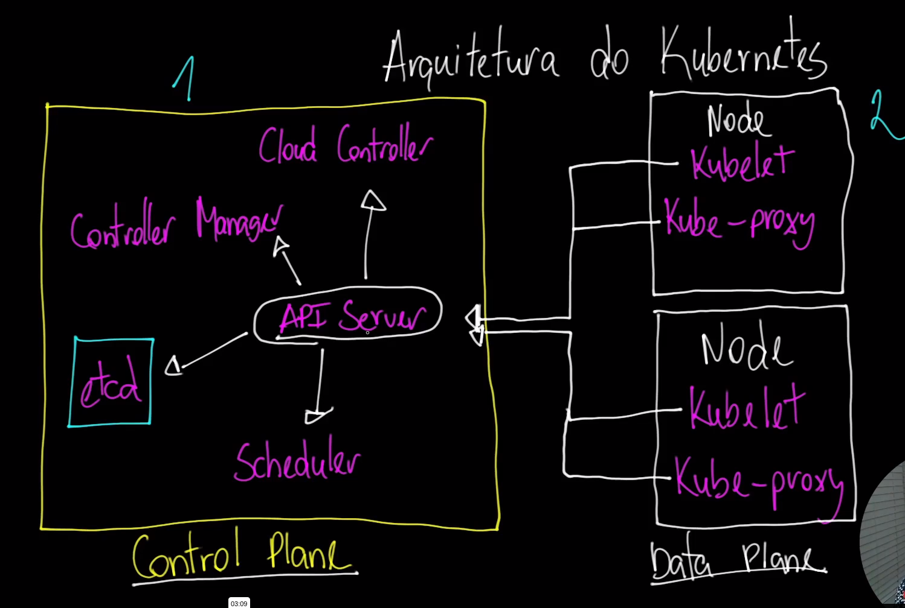

# Arquitetura do Kubernetes

## Control Plane (Abstraído pelos Cloud Providers)

O **Control Plane** é a parte central do Kubernetes responsável por gerenciar e orquestrar todo o cluster. Nos ambientes de Cloud Providers, muitos desses componentes são abstraídos, ou seja, os provedores de nuvem lidam com a sua manutenção e operação.

### Componentes Críticos do Control Plane:

1. **API Server (POD) (Porta 6443)**:  
   - É o principal ponto de interação do Kubernetes. O **API Server** expõe a API do Kubernetes e é responsável por aceitar e validar as solicitações dos usuários, dos componentes internos e dos clientes externos. Tudo o que passa pelo Kubernetes, seja criação, modificação ou consulta de recursos, é gerenciado pelo API Server.
   - **Função**: Serve como uma interface para o cluster, permitindo a comunicação entre diferentes componentes e realizando operações como criação de pods, gerenciamento de nós, entre outros.

2. **Scheduler**:  
   - O **Scheduler** é responsável por distribuir os pods nos diferentes nós de maneira eficiente e sensata. Ele toma decisões com base nos recursos disponíveis nos nós e nas necessidades de cada pod, como CPU, memória e afinidade de nós.
   - **Função**: Planeja onde os novos pods serão executados, garantindo que o cluster utilize os recursos da melhor maneira possível.

3. **Cloud Controller Manager**:  
   - O **Cloud Controller Manager** permite que o Kubernetes interaja com APIs específicas dos provedores de nuvem. Ele é responsável por funções como criar balanceadores de carga (Load Balancers), lidar com discos de armazenamento, e garantir que os nós estejam devidamente integrados com os serviços de nuvem.
   - **Função**: Gerencia a interação do Kubernetes com a infraestrutura de nuvem, como balanceamento de carga e armazenamento.

4. **Controller Manager (POD)**:  
   - O **Controller Manager** é o cérebro do Kubernetes que mantém o estado desejado do cluster. Ele gerencia diferentes tipos de controladores, como o **Replication Controller** (que garante que o número correto de réplicas de um pod esteja em execução) e o **Node Controller** (que monitora o estado dos nós).
   - **Função**: Leva em consideração as políticas definidas pelo usuário e toma ações automáticas para manter o cluster funcionando de acordo com essas políticas.

5. **ETCD (POD)**:  
   - O **ETCD** é o banco de dados de chave-valor distribuído usado pelo Kubernetes para armazenar dados de configuração e o estado do cluster. Ele é extremamente crítico, pois todos os componentes do Kubernetes dependem dele para obter informações sobre o estado do cluster.
   - **Função**: Armazena todos os dados do Kubernetes, incluindo a configuração do cluster, o estado de cada pod, nós e outros recursos. Devido à sua importância, recomenda-se fazer snapshots frequentes desse banco de dados para garantir a recuperação em caso de falhas.

---

## Data Plane (Onde Rodamos as Aplicações)

O **Data Plane** é onde as aplicações do usuário realmente são executadas. Ele é composto pelos nós (máquinas) que executam os containers e as ferramentas que ajudam na comunicação e na execução das aplicações.

### Componentes do Data Plane:

1. **Node**:  
   - Os **Nodes** (nós) são as máquinas (físicas ou virtuais) que compõem o cluster Kubernetes e são responsáveis por executar os pods. Cada nó tem serviços que são essenciais para a execução dos pods e a comunicação entre eles.

2. **Kubelet**:  
   - O **Kubelet** é um agente que roda em cada nó e é responsável por garantir que os containers (pods) estejam rodando como esperado. Ele se comunica diretamente com o **API Server**, obtendo instruções e relatando o status dos pods.
   - **Função**: Gere e monitora os containers dentro do nó, garantindo que os pods sejam executados conforme o planejado pelo Control Plane.

3. **Kube-Proxy**:  
   - O **Kube-Proxy** gerencia a comunicação de rede dentro e fora dos nós, fornecendo mecanismos de roteamento de tráfego de rede para os pods em execução. Ele garante que os serviços dentro do cluster sejam acessíveis e que o tráfego de rede seja distribuído corretamente.
   - **Função**: Configura regras de rede para habilitar a comunicação entre os serviços e os pods dentro do cluster Kubernetes.

---

## Conclusão

O **Kubernetes** possui uma arquitetura distribuída que garante o gerenciamento eficiente de aplicações conteinerizadas em larga escala. O **Control Plane** lida com o planejamento, controle e gerenciamento do cluster, enquanto o **Data Plane** executa as aplicações em si. Essa separação permite alta disponibilidade, resiliência e escalabilidade dentro do cluster.

---

